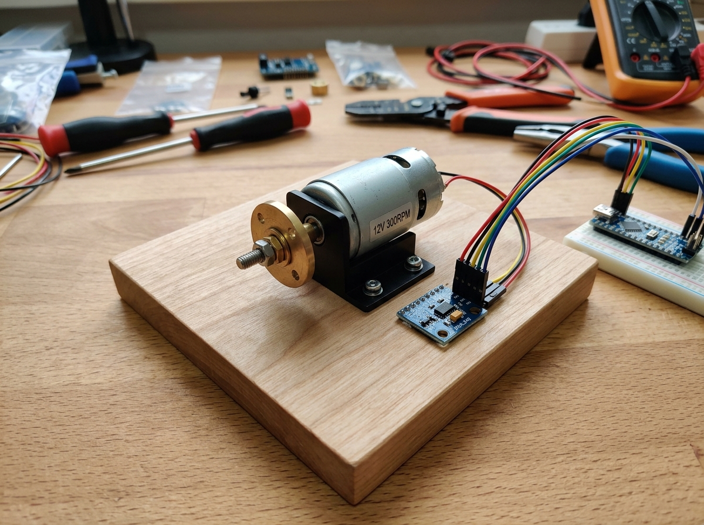

# VibeGuard: Local Sourcing Action Guide & Rig Assembly Manual
**Scope:** Group 3 (Passive Electronic Components) & Group 4 (Mechanical Test Rig Assembly)  
**Target Audience:** Amith Krishna Das (Hardware & Rig Lead) & VibeGuard Integration Team  
**Institution:** Jyothi Engineering College (Autonomous), Cheruthuruthy, Kerala  

---

## 1. Complete Bill of Materials (Group 3 & Group 4)

| Item ID | Component Name | Technical Specification / Code | Qty | Target Sourcing Location | Est. Cost |
|:---:|---|---|:---:|---|:---:|
| **G3-1** | **Electrolytic Bulk Capacitor** | **100 µF, 16V or 25V** (Radial leads, low ESR) | 2 pcs | College ECE/Hardware Lab OR Local TV Repair Shop | ₹0 – ₹5 |
| **G3-2** | **Ceramic Bypass Capacitor** | **100 nF (0.1 µF)**, marked **"104"** (Disc or MLCC) | 2 pcs | College ECE/Hardware Lab OR Local Electronics Shop | ₹0 – ₹2 |
| **G3-3** | **Flyback Clamp Diode** | **1N4007** (1A, 1000V) or 1N5819 (1A, 40V Schottky) | 1 pc | College ECE/Hardware Lab OR Local Electronics Shop | ₹0 – ₹2 |
| **G3-4** | **Current-Limiting Resistors** | **220 Ω, ¼ Watt** (Color code: Red-Red-Brown-Gold) | 2 pcs | College ECE/Hardware Lab drawer | ₹0 – ₹2 |
| **G4-1** | **Rig Baseplate** | Flat wood, plywood, MDF, or 8–10 mm acrylic ($\approx 15 \times 15\text{ cm}$) | 1 pc | College Carpentry / Mech Workshop scrap bin | ₹0 |
| **G4-2** | **Eccentric Weight Bolt** | **M3 × 15 mm** (or M3 × 20 mm) machine screw / hex socket bolt | 1 pc | College Mech Lab OR Local Nut-and-Bolt Shop | ₹1 – ₹2 |
| **G4-3** | **Metal Washers** | **M3 Flat Steel Washers** (Inner dia: 3.2 mm, Outer dia: 7–9 mm) | 4 pcs | College Mech Lab OR Local Nut-and-Bolt Shop | ₹2 |
| **G4-4** | **Nylon Locknut** | **M3 Nyloc Nut** (Nut with internal nylon ring to prevent loosening) | 1 pc | College Mech Lab OR Local Nut-and-Bolt Shop | ₹1 – ₹2 |
| **G4-5** | **Motor Wood Screws** | **M2.5 or M3 wood screws** (length 10–12 mm) to mount U-bracket | 2 pcs | College Mech Lab OR Local Hardware Shop | ₹2 |
| **G4-6** | **3 mm Shaft Coupling / Rotor Arm** | 3 mm bore hub with set-screw OR **3D-Printed Eccentric Rotor Arm** | 1 pc | College FabLab / 3D Printer (Recommended) OR Hobby Store | ₹0 – ₹10 |
| **G4-7** | **Transparent Safety Guard** | Clear plastic enclosure, acrylic box, or transparent cup ($\approx 8 \times 8\text{ cm}$) | 1 pc | Local household shop / Lab scrap plastic container | ₹0 – ₹10 |

---

## 2. Visual Reference: The Assembled Mechanical Rig



*Key features shown: (1) Rigid wooden baseplate, (2) Metal N20 mounting bracket bolted to wood, (3) 3 mm shaft hub holding an off-center M3 bolt and washers, (4) ADXL345 sensor bolted rigidly beside the motor, sharing structural vibration.*

---

## 3. Local Sourcing Action Playbook: Where, Whom & What to Ask

### Location A: College Electronics / Hardware Labs (ECE & CSE Departments)
* **Target Components:** 100 µF capacitor, 100 nF ("104") ceramic capacitor, 1N4007 diode, 220 Ω resistors.
* **Whom to Ask:** The Lab Assistant, Technical Officer, or Lab in-charge of the Basic Electronics Lab or Microcontroller Lab.
* **What to Say (Dialogue Script):**
  > *"Good morning Sir/Madam, we are working on our PBCST504 Microcontroller semester project (VibeGuard vibration monitor). We need a few standard basic passives from the component store if available:*
  > *1. One or two **100 µF (16V or 25V) electrolytic capacitors** for power filtering.*
  > *2. Two **100 nF ceramic capacitors** (the small disc ones marked '104').*
  > *3. One **1N4007 diode** for motor flyback protection.*
  > *4. Two **220 Ω resistors** for our RGB LED.*
  > *Could you please issue these from the lab inventory drawer?"*
* **If unavailable at college:** Any local TV/electronics repair shop or consumer electronics service center in Cheruthuruthy or Shoranur will hand you all four parts from their workbench for ₹10 cash.

---

### Location B: College Mechanical Workshop & Carpentry Lab
* **Target Components:** The Wooden Baseplate ($\approx 15 \times 15\text{ cm}$), M3 wood mounting screws, and scrap acrylic.
* **Whom to Ask:** The Carpentry Workshop Instructor or Mechanical Workshop Superintendent.
* **What to Say (Dialogue Script):**
  > *"Sir, we are engineering an embedded machine monitoring rig for our project. We need a small, sturdy flat baseboard to mount a miniature motor and sensor.*
  > *Do you have a small offcut scrap piece of **plywood, hardwood, or 8–10 mm thick acrylic sheet**, roughly **$15 \times 15\text{ cm}$ (or 6 inches square)** from the scrap bin? Also, if possible, 2 small wood screws to fasten a small metal bracket?"*
* **Key Spec:** The wood must be flat, dense, and at least 8 mm to 12 mm thick so that vibration from the motor travels through the wood into the sensor without flexing or warping.

---

### Location C: College FabLab / Makerspace (3D Printing Option)
* **Target Components:** 3 mm Shaft Eccentric Rotor Arm & ADXL345 Sensor Standoff Bracket.
* **Whom to Approach:** FabLab Student Coordinator, Makerspace Technician, or 3D Printing Operator.
* **What to Request & Exact CAD Specifications:**
  Ask to print a small **Eccentric Vibration Cam/Arm** in standard PLA (20% to 30% infill, takes 8–12 minutes):
  1. **Motor Shaft Bore:** A cylindrical hole of **$3.0\text{ mm}$ diameter with a flat 'D' profile** (matching the N20 D-shaft flat side) so it slides tightly onto the shaft without slipping.
  2. **Arm Length / Offset Radius ($r$):** Distance between the center of the shaft hole and the mass hole = **$10\text{ mm}$ to $12\text{ mm}$**.
  3. **Off-Axis Bolt Hole:** A **$3.2\text{ mm}$ through-hole** to pass the M3 bolt.
  4. **Set Screw Hole (Optional but good):** A small 2.5 mm lateral hole on the side to tap an M3 grub screw if a friction fit isn't snug.
* **What to Say (Dialogue Script):**
  > *"Hi, I have a tiny 5-gram 3D model for our microcontroller vibration rig. It's a small 3mm D-shaft eccentric cam arm to hold a small M3 bolt for vibration testing. Can we slice and print this on the Ender-3 / Prusa using PLA?"*

---

### Location D: Local Nut-and-Bolt / Hardware Store (Cheruthuruthy / Shoranur / Thrissur)
* **Target Components:** M3 Machine Bolts, Washers, and Nyloc Locknuts.
* **Where to Go:** Any local retail hardware store, nut-bolt specialist, or motorcycle/bicycle spare parts shop.
* **What to Ask the Shopkeeper:**
  > *"Bhai / Chetta, do you have small metric machine screws? I need:*
  > *• One **M3 size, 15 mm length bolt** (Allen key or Star head).*
  > *• Four **M3 flat steel washers**.*
  > *• One **M3 Nyloc nut** (the nut with the white nylon plastic lock ring inside).*
  > *• Two small **self-tapping wood screws** (around 10 mm length) to screw a bracket into wood."*
* **Cost:** Typically ₹5 to ₹10 for the entire handful.

---

## 4. Rig Assembly & Wiring Instructions: What to Do with Each Part

```
                    +-------------------------------------------------------+
                    |                 VIBEGUARD PHYSICAL RIG                |
                    |                                                       |
                    |   [ 12V Wall Adapter ]                                |
                    |            |                                          |
                    |            v                                          |
                    |   [ DC Barrel Jack ] ---> [ KCD1 Switch ] ---> [ Fuse ]
                    |                                                  |    |
                    |   +----------------------------------------------+    |
                    |   |                                                   |
                    |   |        [ 1N4007 Diode (Silver Band to +12V) ]     |
                    |   |                     |                             |
                    |   v                     v                             |
                    |  (+) ---------------------------------- (-)           |
                    |         N20 12V GEAR MOTOR (600 RPM)                  |
                    |                      |                                |
                    |          [ 3mm D-Shaft Hub / Arm ]                    |
                    |                      |                                |
                    |          [ M3 Bolt + Washers + Nyloc ]                |
                    |          (Centrifugal Vibration: 10 Hz)               |
                    |                      |                                |
                    |      [ RIGID WOODEN BASEPLATE (15x15 cm) ]            |
                    |                      |                                |
                    |                      v                                |
                    |             [ ADXL345 SENSOR ]                        |
                    |                      | (4-Wire SPI)                   |
                    |                      v                                |
                    |             [ 7Semi ESP32 MCU ] <--- 5V USB (PC)      |
                    |                      |                                |
                    |         [ 100uF + 100nF Caps across 3V3/GND ]         |
                    +-------------------------------------------------------+
```

### Step 1: Baseplate & Motor Mounting (G4-1 & G4-5)
1. Place the flat wooden baseplate on a level desk.
2. Position the metal N20 U-bracket roughly in the center-left of the board.
3. Slide the N20 motor inside the bracket and tighten the bracket's clamping screw around the brass gearbox.
4. Use the two small wood screws (**G4-5**) to fasten the bracket firmly into the wooden plank. Ensure the motor does not wiggle or tilt.

### Step 2: Assembling the Eccentric Mass Rotor (G4-2, G4-3, G4-4, G4-6)
1. Take the 3D-printed rotor arm (or 3 mm metal hub).
2. Insert the **M3 × 15 mm bolt** through the off-axis hole.
3. Thread **3 to 4 steel washers** onto the bolt. These washers provide the off-center unbalance mass ($m \approx 2.5\text{ g}$).
4. Screw on the **M3 Nyloc nut** and tighten firmly with a spanner/pliers.
   > [!IMPORTANT]
   > A standard plain nut can vibrate loose within 30 seconds of motor rotation. The **nylon ring inside the Nyloc nut** prevents it from ever vibrating loose.
5. Push the completed hub/arm assembly onto the motor's 3 mm D-shaft and tighten the set screw (or check the tight friction fit).

### Step 3: Rigid Sensor Mounting (ADXL345)
1. Place the ADXL345 breakout board on the wooden base **15 mm to 25 mm away from the motor bearing face**.
2. Fasten the sensor board firmly to the wood using two small screws or a rigid 3D-printed clip.
   > [!CAUTION]
   > **Prohibited:** Do NOT use squishy double-sided foam tape or hot glue. Soft materials act as vibration dampers/shock absorbers that attenuate high-frequency signals and distort FFT readings.

### Step 4: Soldering the 1N4007 Flyback Diode (G3-3)
1. Inspect the 1N4007 diode: Notice the body has a **printed silver/white band** at one end. That end is the **Cathode**.
2. Solder the diode directly across the two electrical solder lugs on the back of the N20 motor:
   * **Cathode (Silver Band end):** Solder to the **Positive (+12V)** motor terminal.
   * **Anode (Plain black end):** Solder to the **Negative (GND)** motor terminal.
3. **Engineering Purpose:** An electric motor is a large inductive coil. When the KCD1 switch is turned OFF, the collapsing magnetic field creates a reverse voltage spike (back-EMF) that can exceed 100V. The 1N4007 instantly clamps this spike safely, protecting your switch contacts and nearby sensor logic.

### Step 5: Wiring the DC Power Input Jack & Isolation
1. Take the screw-terminal DC female jack:
   * Connect the **`+` terminal** to one pin of the **KCD1 Rocker Switch**.
   * From the other pin of the switch, wire to the **inline fuse holder** (carrying the 1A fuse).
   * From the fuse holder, connect to the motor **Positive (+12V)** terminal.
   * Connect the **`-` terminal** of the DC jack directly to the motor **Negative (GND)** terminal.
2. **Absolute Galvanic Isolation Rule:**
   * The 12V motor ground must **NEVER** touch the ESP32 ground pin.
   * The ESP32 is powered exclusively via the 5V USB cable from the laptop. 
   * Testing rule: Touch multimeter probes between motor GND and ESP32 GND. The meter must read **Open Circuit / Infinite Ohms ($\infty\ \Omega$)**.

### Step 6: Power Decoupling on the Breadboard (G3-1, G3-2, G3-4)
1. Seat the **7Semi ESP32-DEVKIT-E** firmly into the breadboard.
2. **Install the 100 µF Electrolytic Bulk Capacitor (G3-1):**
   * Identify polarity: The side with a white/grey stripe and minus signs `---` is the **Negative lead** (shorter pin). The other lead is **Positive**.
   * Insert the **Positive lead** into the breadboard row connected to the ESP32 **3V3 pin (Pin 1)**.
   * Insert the **Negative lead** into the breadboard **GND rail (Pin 14)**.
   * Keep leads trimmed short ($\le 5\text{ mm}$).
3. **Install the 100 nF Ceramic Capacitor (G3-2):**
   * Insert directly in parallel with the 100 µF capacitor across the 3V3 and GND rows (ceramic caps are non-polarized).
   * **Engineering Purpose:** When the ESP32 initiates Wi-Fi calibration or high-speed processing bursts, current spikes to 500 mA. The 100 µF capacitor dumps stored charge in microseconds, preventing the AMS1117 LDO from dropping below the 2.70V Brownout threshold (`rst:0x10`).
4. **Install the 220 Ω Resistor (G3-4):**
   * Insert in series with the **Red anode pin** of the RGB status LED connected to GPIO27. *(Robu already supplied 330 Ω for Green/Blue).*

### Step 7: Transparent Safety Guard (G4-7)
1. Take a small, sturdy transparent container (clear acrylic box or thick clear plastic cup).
2. Place it over the spinning eccentric hub and motor shaft.
3. Fasten it to the wooden base with 2 small screws or brackets.
4. **The 360° Clearance Test:** With power disconnected, reach in and turn the motor shaft by hand one full circle ($360^\circ$). Ensure there is at least **$5\text{ mm}$ of clear space** between the rotating bolt/washers and the inside walls of the guard.

---

## 5. Pre-Power Safety Sign-Off (Amith's Checklist)

Before plugging in the 12V wall adapter or the USB cable:
- [ ] **Locking Nut Checked:** M3 Nyloc nut is threaded past the nylon collar on the eccentric bolt.
- [ ] **Clearance Checked:** Manually rotated $360^\circ$ — zero contact with baseplate or safety guard.
- [ ] **Flyback Diode Checked:** 1N4007 silver band is connected to the +12V motor terminal.
- [ ] **Galvanic Isolation Checked:** Multimeter confirms $\infty\ \Omega$ between 12V motor DC ground and ESP32 USB logic ground.
- [ ] **Bulk Cap Polarity Checked:** Negative stripe of 100 µF capacitor is connected to GND, not 3V3.
- [ ] **Fuse Verified:** 1A fast/time-delay cartridge fuse is inside the holder.
